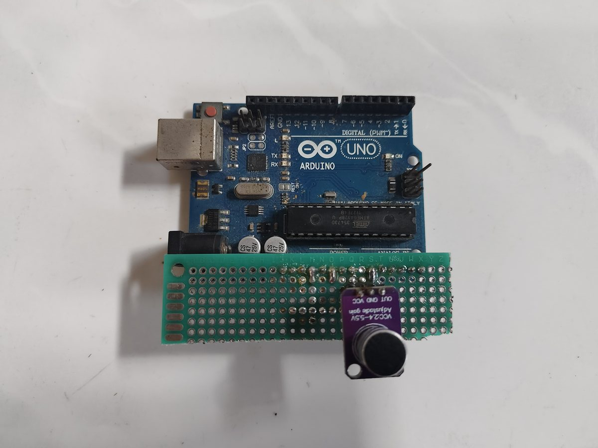
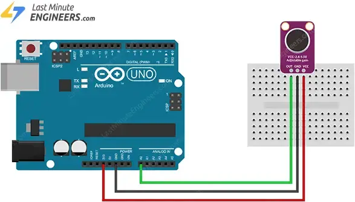

# MAX4466 Microphone Callibration

Just play static white noise (in a controlled way, same distance, volume, etc) and compare the output analog reading from each of the MAX4466 module

## Circuit Diagram

